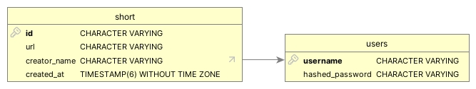
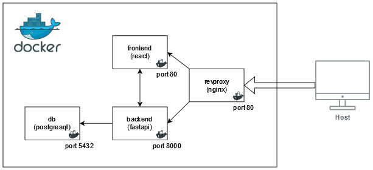

# CSC 8567 - Projet : shorturl

## Schéma de la base de données


## Schéma de l'infrastructure


Statut de build des images :
[](https://github.com/superdarki/shorturl/actions/workflows/docker-publish.yml)

## Routes de l'application

- `GET /` : la partie visuelle du frontend n'utilise que cet endpoint
- `GET /<id:string>` : redirections des url raccourcies
- `POST /api/login` : permet d'obtenir un cookie de connexion
- `POST /api/register` : permet d'enregister un nouvel utilisateur
- `GET /api/mylinks` : permet d'obtenir la liste des liens créés par l'utilisateur connecté
- `GET /api/links` : permet d'obtenir la liste de tous les liens (uniquement utilisable par "admin")
- `POST /api/create` : permet l'ajout d'une nouvelle url raccourcie
- `GET /api/<id:string>` : permet d'obtenir le lien lié à une url raccourcie

## Questions

### Django

- **Affichage d'*index.html***
  - *public/templates/public/index.html*
    ```html
    <!DOCTYPE html>
    <html>
        <head>
            <title>Acceuil - Projet</title>
        </head>
        <body>
            <h1>Bienvenue sur l'acceuil de mon super projet :)</h1>
        </body>
    </html>
    ```
  - *public/views.py*
    ```py
    from django.shortcuts import render

    def index(request):
        return render(request, 'public/index.html')
    ```
  - *public/urls.py* -> urls de l'app public
    ```py
    from django.urls import path
    import views

    urlpatterns = [
        path('', views.index, name='index'),
    ]
    ```
  - *projet/urls.py* -> urls du projet complet
    ```py
    from django.contrib import admin
    from django.urls import path, include

    urlpatterns = [
        path('admin/', admin.site.urls),
        path('', include('public.urls')),
    ]
    ```
- **Configuration de la BDD**  
Pour configurer la base de données, on utilise la variable `DATABASES = []` de *projet/settings.py*
- **Fichiers de paramètres**  
  - *projet/settings.py* : ce fichier permet de configurer les paramètres d'exécution de django, il est possible d'utilise un fichier différent grâce à la variable d'environement `DJANGO_SETTINGS_MODULE`
  - *projet/{a,w}sgi.py* : ce(s) fichier(s) permetent de définir les paramètres appliqués au serveur web (ex: Gunicorn) lors d'un déploiement en prodution
- **Migrations BDD**
  - `python manage.py makemigrations` : cette commande génère les fichiers de migration (modification) de la base de données à partir des modèles définis dans *models.py* et les stockes dans *public/migrations/*
  - `python manage.py migrate` : cette commande applique les migrations à la base de données à partir des migrations dans *public/migrations/*

### Docker

- **Syntaxe *Dockerfile***
  - `FROM` : spécifie l'image sur laquelle on se base
  - `RUN` : exécute une commande pendant le build
  - `WORKDIR` : spécifie le répertoire de travail (cwd)
  - `EXPOSE` : spécifie un port à rendre accessible depuis l'hôte
  - `CMD`  : spécifie la commande de démmarage du conteneur
- **Syntaxe *docker-compose.yml***
  - ```
    ports: -> liste des ports du conteneur à rendre disponible sur l'hôte
      - "80:80" -> host:ct = on affecte le port 80 de l'hôte au port 80 du conteneur
    ```
  - ```
    build: -> spécifie que l'on utilise va utiliser une image locale que l'on va build
      context: . -> spécifie le dossier utilisé pour build l'image
      dockerfile: Dockerfile.api -> spécifie le Dockerfile utilisé par l'image
    ```
  - ```
    depends_on: -> liste les conteneurs devant démarrer avant le conteneur actuel
      - web
      - api
    ```
  - ```
    environment: -> spécifie la liste des variables d'environement à passer au conteneur pour l'exécution
      POSTGRES_DB: ${POSTGRES_DB}
      POSTGRES_USER: ${POSTGRES_USER}
      POSTGRES_PASSWORD: ${POSTGRES_PASSWORD}
    ```
- Pour définir une variable d'environement dans un conteneur on peut utiliser :
  - la section `environement:` dans le *docker-compose.yml*
  - l'option `-e` avec *docker run*
  - l'instruction `ENVIRONEMENT` dans le *Dockerfile*
- On peut utiliser le nom du conteneur *web* dans la configuration du conteneur *nginx* grâce à la résolution interne des noms réalisée par docker pour les conteneurs d'un même réseau